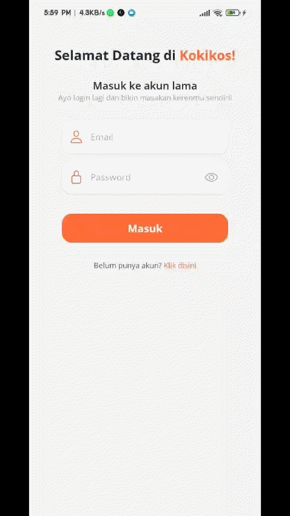

<h1 align="center">
   <strong>KokiKos - Pendamping Memasak Pintar Anak Kos</strong>
</h1>

<p align="center">
  
</p>

<p align="center">
  <strong>Solusi cari resep masakan ramah kantong berdasarkan bahan yang ada.</strong>
</p>

<p align="center">
  
  
  
</p>

---

## 💡 Tentang KokiKos

**KokiKos** adalah aplikasi mobile berbasis Android yang dirancang khusus untuk membantu mahasiswa atau anak kos dalam mengatasi kebingungan memasak sehari-hari. Dengan memanfaatkan kekuatan Kecerdasan Buatan (AI), aplikasi ini bertindak sebagai asisten dapur pribadi yang mampu meracik resep masakan kreatif, lezat, dan ramah kantong hanya dari bahan-bahan makanan seadanya yang tersisa di kulkas kamu.

Cukup masukkan daftar bahan makanan yang kamu miliki, dan **KokiKos** akan menyajikan pilihan resep terbaik lengkap dengan perhitungan estimasi waktu, estimasi biaya, hingga persentase kecocokan bahan!

---

## 📱 Demo Aplikasi

<p align="center">
  
</p>

---

## 🚀 Fitur Utama

* **🔍 Smart Ingredient Input:** Masukkan bahan makanan yang kamu miliki satu per satu secara dinamis beserta takaran atau kuantitasnya.
* **🤖 AI-Powered Recipe Generation:** Terintegrasi langsung dengan Google Gemini API untuk merancang resep masakan kreatif yang disesuaikan dengan bahan-bahan di dapurmu.
* **💰 Budget & Time Estimation:** Dapatkan transparansi informasi perkiraan biaya memasak dan estimasi waktu pembuatan agar sesuai dengan jadwal kuliahmu.
* **📊 Comprehensive Recipe Detail:** Setiap resep menyajikan panduan memasak yang sangat mendalam:
    * 🛠️ **Bahan & Alat:** Daftar detail takaran bahan masakan serta peralatan dapur yang dibutuhkan.
    * 📝 **Langkah Memasak:** Instruksi step-by-step terstruktur yang sangat mudah dipahami oleh pemula.
    * 🍎 **Informasi Nutrisi:** Pantau persentase gizi masakan mulai dari karbohidrat, protein, lemak, hingga kalori.
* **🔖 Saved Recipes (Bookmark):** Simpan resep-resep favoritmu ke dalam database untuk diakses kembali dengan cepat di lain waktu.
* **🎨 Seamless Nested Navigation:** Antarmuka dengan sistem *custom bottom tabs* yang responsif, menjaga kenyamanan bernavigasi tanpa kehilangan konteks halaman terakhir yang kamu buka.

---

## 🛠️ Tech Stack

Aplikasi ini dibangun menggunakan ekosistem teknologi modern:

* **Framework:** [React Native](https://reactnative.dev/) dengan [Expo SDK](https://expo.dev/)
* **Navigation:** [Expo Router](https://docs.expo.dev/router/introduction/)
* **Language:** TypeScript
* **Database & Authentication:** [Supabase](https://supabase.com/)
* **State Management:** React Context API (`UserDetailContext`)
* **Styling:** React Native StyleSheet
* **AI Engine:** Google Gemini API

---

## 📦 Panduan Instalasi Lokal

Ikuti langkah-langkah berikut untuk menjalankan proyek ini di komputer lokal kamu:

### Prasyarat
* Sudah menginstal **Node.js** (versi v18 atau yang terbaru)
* Sudah menginstal aplikasi **Expo Go** di HP Android kamu untuk keperluan uji coba.

### Langkah-Langkah

1.  **Clone Repositori Ini**
    ```bash
    git clone [https://github.com/username_kamu/kokikos.git](https://github.com/username_kamu/kokikos.git)
    cd kokikos
    ```

2.  **Install Dependensi**
    ```bash
    npm install
    ```

3.  **Konfigurasi Environment Variables (`.env`)**
    Buat file bernama `.env` di folder root proyek, lalu masukkan kredensial API Supabase dan Gemini Key yang dibutuhkan:
    ```env
    EXPO_PUBLIC_SUPABASE_URL=isi_dengan_url_supabase_kamu
    EXPO_PUBLIC_SUPABASE_ANON_KEY=isi_dengan_anon_key_supabase_kamu
    EXPO_PUBLIC_GEMINI_API_KEY=isi_dengan_api_key_gemini_kamu
    ```

4.  **Jalankan Aplikasi**
    ```bash
    npx expo start -c
    ```

5.  **Scan QR Code**
    Buka aplikasi **Expo Go** di HP Android kamu, pilih **Scan QR Code**, lalu arahkan kamera ke kode QR yang muncul di terminal komputer kamu.

---

## 🤝 Kontribusi

Kontribusi selalu terbuka lebar! Jika kamu menemukan *bug*, ingin menambahkan fitur baru, atau memperbaiki dokumentasi, silakan ikuti alur berikut:

1. Fork repositori ini.
2. Buat branch fitur baru (`git checkout -b fitur/FiturKerenKamu`).
3. Commit perubahanmu (`git commit -m 'Menambahkan fitur keren X'`).
4. Push ke branch tersebut (`git push origin fitur/FiturKerenKamu`).
5. Buat *Pull Request* baru di GitHub.

---

## 📄 Lisensi

Proyek ini dilisensikan di bawah **MIT License**.

---

<p align="center">
  Dibuat dengan 💻 dan 🥤 oleh <a href="https://arisandi-satria.vercel.app">Arisandi Satria</a>
</p>